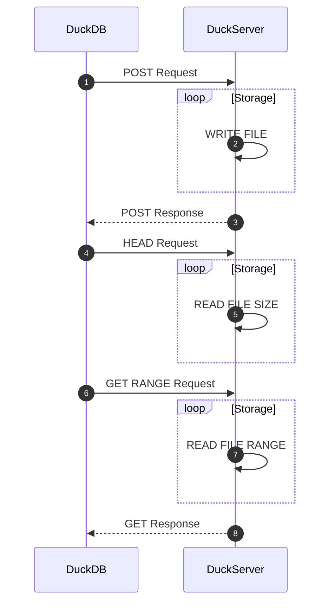

# DuckDB URL Storage Engine
The URL Engine provides format agnostic remote storage for DuckDB/Clickhouse with hive-style partitioning.<br>

### Demo
A public demo instance is available at [https://urleng.glitch.me](https://urleng.glitch.me)

##### Features
- [x] INSERT Files via POST
- [x] SELECT Files via GET/HEAD
- [x] HTTP RANGE Support

#### Usage
##### Golang
Install and run the example GO service :
```
cd go/
go mod tidy
PORT=80 go run server.go
```

### Examples
#### 📦 DuckDB

You can COPY and SELECT from the URL Engine using extensions `json`,`csv`,`parquet`

```sql
D SET enable_http_write = 1;

D COPY (SELECT version() as version, 9999 as number) TO 'https://urleng.glitch.me/test.json';
D SELECT * FROM read_json_auto('https://urleng.glitch.me/test.json');
┌─────────┬────────┐
│ version │ number │
│ varchar │ int64  │
├─────────┼────────┤
│ v1.1.0  │   9999 │
└─────────┴────────┘

D COPY (SELECT version() as version, 9999 as number) TO 'https://urleng.glitch.me/test.parquet';
D SELECT * FROM read_parquet('https://urleng.glitch.me/test.parquet');
┌─────────┬────────┐
│ version │ number │
│ varchar │ int64  │
├─────────┼────────┤
│ v1.1.0  │   9999 │
└─────────┴────────┘

D SELECT * FROM parquet_schema('https://urleng.glitch.me/test.parquet');
┌──────────────────────┬───────────────┬────────────┬─────────────┬───┬────────────────┬───────┬───────────┬──────────┬──────────────┐
│      file_name       │     name      │    type    │ type_length │ … │ converted_type │ scale │ precision │ field_id │ logical_type │
│       varchar        │    varchar    │  varchar   │   varchar   │   │    varchar     │ int64 │   int64   │  int64   │   varchar    │
├──────────────────────┼───────────────┼────────────┼─────────────┼───┼────────────────┼───────┼───────────┼──────────┼──────────────┤
│ https://duckserver…  │ duckdb_schema │            │             │ … │                │       │           │          │              │
│ https://duckserver…  │ version       │ BYTE_ARRAY │             │ … │ UTF8           │       │           │          │              │
│ https://duckserver…  │ number        │ INT32      │             │ … │ INT_32         │       │           │          │              │
├──────────────────────┴───────────────┴────────────┴─────────────┴───┴────────────────┴───────┴───────────┴──────────┴──────────────┤
│ 3 rows                                                                                                        11 columns (9 shown) │
└────────────────────────────────────────────────────────────────────────────────────────────────────────────────────────────────────┘
```

##### HTTP/S HEADERS
When Authentication is enabled, you can pass headers and other parameters using _SECRETS_

```sql
CREATE SECRET extra_http_headers (
    TYPE HTTP, 
    EXTRA_HTTP_HEADERS MAP{
		'Authorization': 'Bearer ${SOME_TOKEN}',
		'CustomHeader': 'abc123'
	}
);
```

##### Native format

You can also upload and attach a native DuckDB `.duckdb` database file and attach it to a read-only session
```bash
curl --data-binary @/path/to/myduck.db https://urleng.glitch.me/myduck.db
```
```sql
ATTACH 'https://urleng.glitch.me/myduck.db' as remote; SELECT * FROM remote.table;
```


#### 📦 ClickHouse
##### INSERT
```sql
INSERT INTO FUNCTION url('https://urleng.glitch.me/click.parquet', 'PARQUET', 'column1 String, column2 UInt32') VALUES (version(), 999);
```
##### SELECT
```sql
SELECT * FROM url('https://urleng.glitch.me/click.parquet', PARQUET) FORMAT Pretty;

   ┏━━━━━━━━━━┳━━━━━━━━┓
   ┃ version  ┃ number ┃
   ┡━━━━━━━━━━╇━━━━━━━━┩
1. │ 24.5.1.1 │    999 │
   └──────────┴────────┘
```

##### DESCRIBE
```sql
DESCRIBE TABLE url('http://https://urleng.glitch.me/click.parquet', PARQUET) FORMAT Pretty;

   ┏━━━━━━━━━┳━━━━━━━━━━━━━━━━━━┳━━━━━━━━━━━━━━┳━━━━━━━━━━━━━━━━━━━━┳━━━━━━━━━┳━━━━━━━━━━━━━━━━━━┳━━━━━━━━━━━━━━━━┓
   ┃ name    ┃ type             ┃ default_type ┃ default_expression ┃ comment ┃ codec_expression ┃ ttl_expression ┃
   ┡━━━━━━━━━╇━━━━━━━━━━━━━━━━━━╇━━━━━━━━━━━━━━╇━━━━━━━━━━━━━━━━━━━━╇━━━━━━━━━╇━━━━━━━━━━━━━━━━━━╇━━━━━━━━━━━━━━━━┩
1. │ version │ Nullable(String) │              │                    │         │                  │                │
   ├─────────┼──────────────────┼──────────────┼────────────────────┼─────────┼──────────────────┼────────────────┤
2. │ number  │ Nullable(UInt32) │              │                    │         │                  │                │
   └─────────┴──────────────────┴──────────────┴────────────────────┴─────────┴──────────────────┴────────────────┘
```
##### SET PARAM
```sql
SET param_url = 'https://urleng.glitch.me/your_secret_token';
INSERT INTO FUNCTION url({url:String}, JSONEachRow, 'key String, value UInt64') VALUES ('hello', 1);
SELECT * FROM url({url:String}, JSONEachRow);
```


### Design Flow


